# FOG OF WAR

## Presentation
Hello, this is a research project of Fog of War implementation in an RTS game. It is made for the Bachelor degree in Game Development and Design in CITM, UPC. This content is generated for the second year's subject Project 2, under supervision of lecturer Ramon Santamaria. 

## What is Fog of war?

Fog of war is a term that refers to describe the uncertainty in situation awareness experienced for militars in military operations. However, in video games, the fog of war reffers to giving the player partial information of a certain area, which makes the player re-think the strategy of the gameplay taking in account the leaking information. 

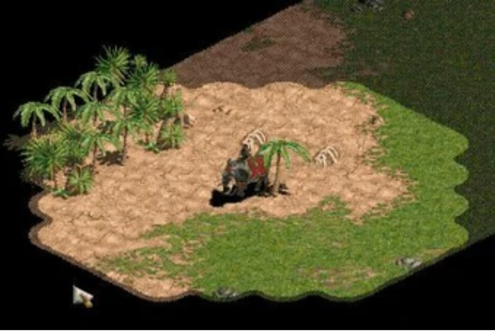
Age of Empires 2 for PC

## Early stages

The earliest use of fog of war was in the 1977 game Empire by Walter Bright, and in 1978 in the game Tanktics from Chris Crawford. Later on, in 1982, he said "limit[ing] the amount of information available to the human player" to compensate for the computer's lack of intelligence.
From this moment, games like Age of Empires started to add this functionality and more advanced features, like hidden effects. 

Empire for AMIGA

## Types of Fog of War

## Tiled version

A tile based game is when the possible positions of the map are grouped in small areas that can be differenciated between them, instead of pixels. The areas can vary between games, but the most used are squares, hexagons, and distorted squares that create an isometric perspective effect. 

In these games the fog of war is managed with a meta-data information copy of the map that contains the fog information of the tiles (if the tiles are fogged, visited, unvisited,...)

Common games that use tiled version fog of war are RTS based games, like Warcraft II and Age of Empires saga. 

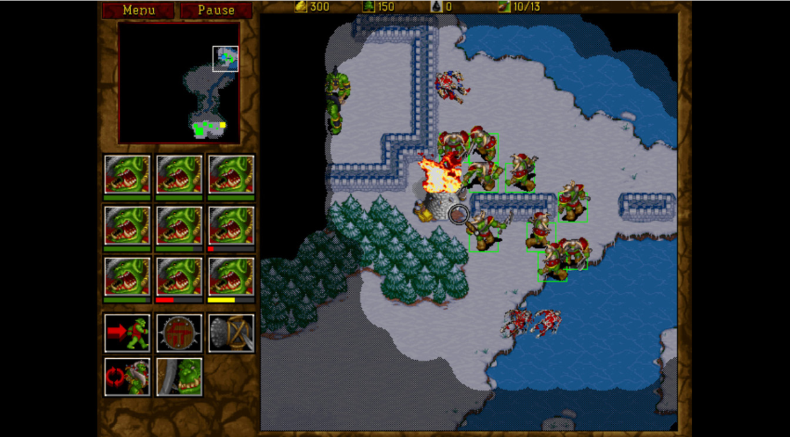
Warcraft II for PC

## Masked version

A masked fog of war is made by printing an image overlapping the visible information of the map so that the player can't see it.
The most common usage is to manage the color and the alpha of the overlapping image, so we can allow the player to see the screen through it. 
Common games are 2D RPG games, like Pokemon in dark caves, where you need the HM flash to remove the fog. 

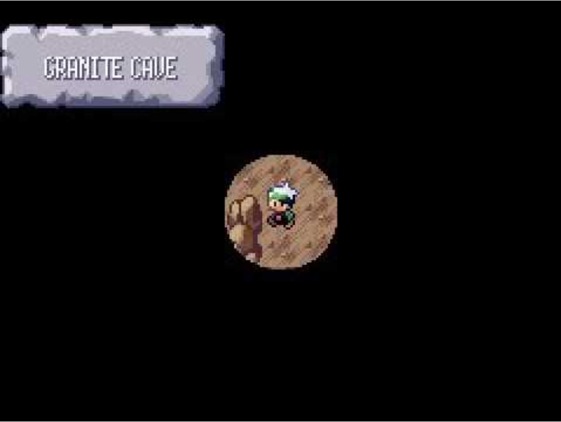
Pokemon Emerald for GameBoy Advance

## 2D vision games

Fog of war in these games is a bit more complex than other types. In these games, the program simulates 2D areas from making raycast from a vision emitter to nearby objects, the same way a static light illuminates a room. The most common usage is to create 2D complex forms from the collision of the raycast to the nearby vertexes of the objects surrounding the provider of visibility. This way we can generate an area which will have visibility characteristics, and will pack the whole non-visible area to fogged area. The principal games that use this system are MOBA's like League of Legends and DOTA 2. 
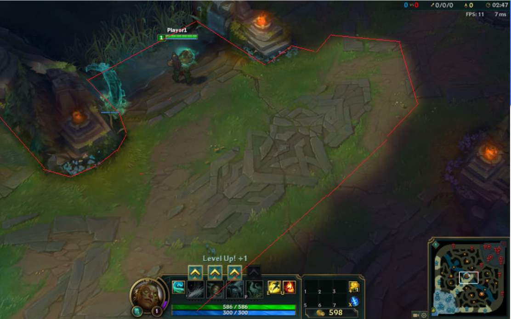
League of Legends Fog of War areas highlighted

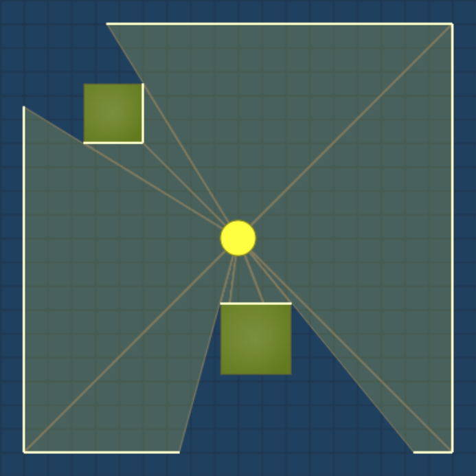
Raycast debug of the area creation method

## Code implementation

The handout has a basic program that lets the user move a providing balloon with the keyboard arrow keys and move the camera with WASD, and displays a "sea" map with certain hidden enemy entities. 

TODO 1: Change the map blit so it takes in account fogged tiles. 

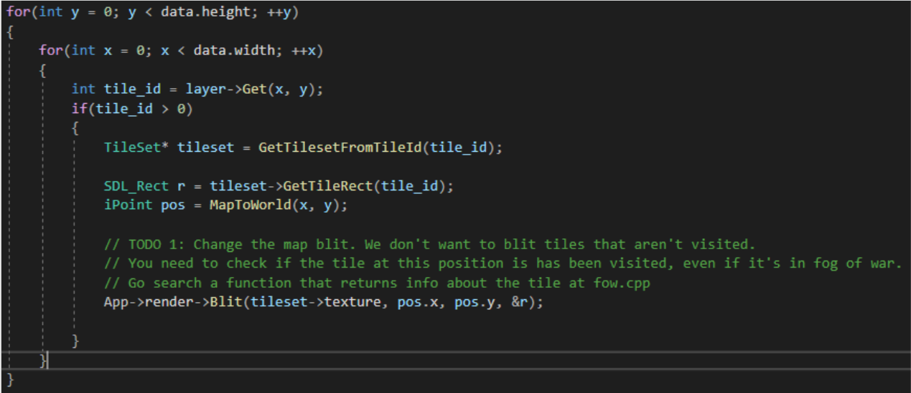

TODO 2: Create the entity texture and save the pointer. Do the same for the player

TODO 3: Update the enemy so it’s state is synced with it’s fow_entity. Do the same for the player entity

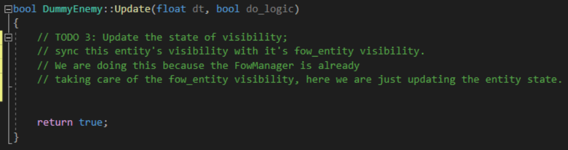

TODO 4: Update the fow_entity position from the entity position

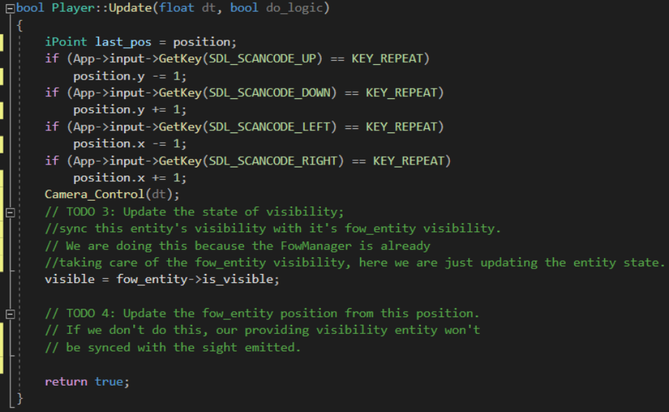

TODO 5: Set the ID list where we are storing the iPoints of the map, with the radius range and the position of the vision provider
Then fill the LOS with FulfillSight method 

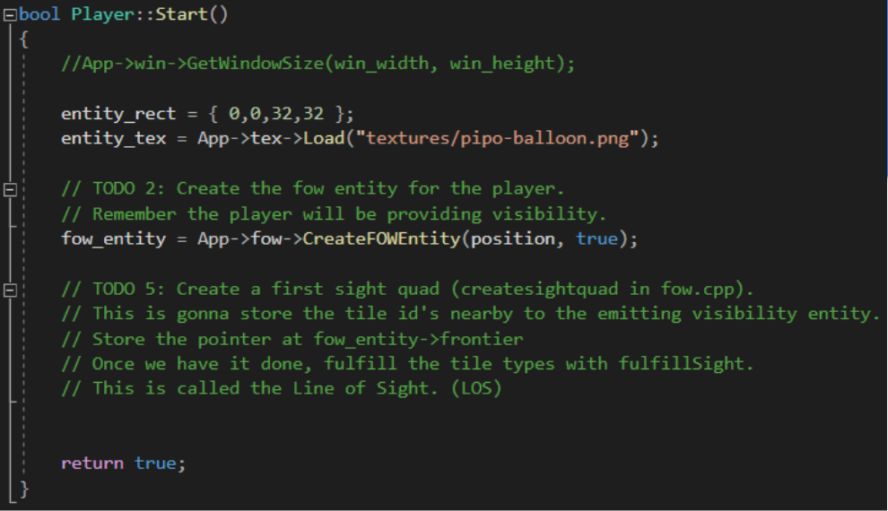

TODO 6: Iterate all tiles to update their position every time the vision emitter changes position
We store the motion every time the player moves, so we don’t care the amount or direction the 
player moves. 

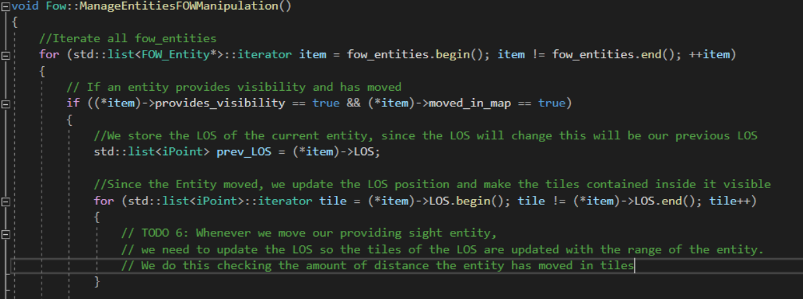

TODO 7: Set the visibility of every tile we just moved to VISIBLE

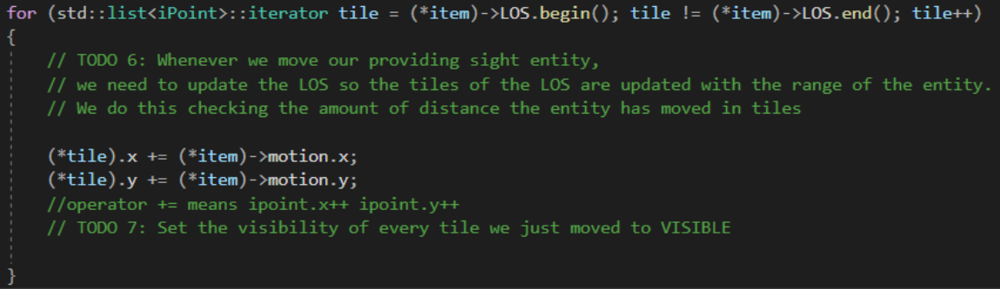

TODO 8: We have stored in memory both the previous list and the new one
We need to set into fogged those tiles that ARE in the previous list and ARE NOT in the new one, because they are not in the LOS anymore
We can do the comparison with TileInsideList method

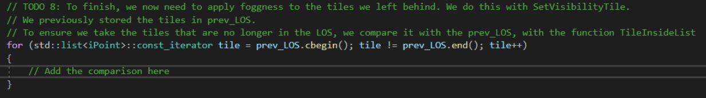

## Possible Innovations

- Smoothing edges of the border visible tiles so it visually looks more clean and natural
- Making the tiles have an animation that would make the fogged tiles have a transition between being fully visible and being semi-opaque when changed. 
- Making an entity use the state of visibility to have certain effects. For example, more damage if it is being under fog of war. 
- Modifying the A* so it takes in account if a tile is under fog of war. Would we want our troops to pass through a fog of war? Should we avoid it? What would be the walkability value for the fog of war?

## References

<a href="https://en.wikipedia.org/wiki/Fog_of_war">Fog of War history and early stages</a>

<a href="https://https://www.redblobgames.com/articles/visibility/">2D visibility explanation</a>

<a href="http://bobkoon.com/how-to-implement-a-fog-of-war-part-1-chunky/">Explanation of how we take the area from the map</a>
