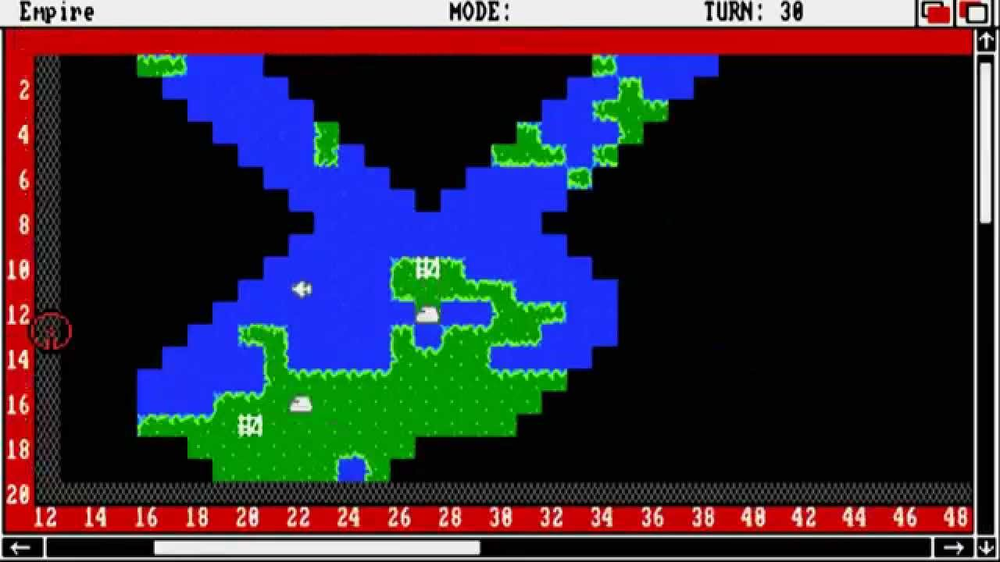

# FOG OF WAR

Hello, this is a research project of Fog of War implementation in an RTS game. It is made for the Bachelor degree in Game Development and Design in CITM, UPC.

## What is Fog of war?

Fog of war is a term that refers to describe the uncertainty in situation awareness experienced for militars in military operations. However, in video games, the fog of war reffers to giving the player partial information of a certain area, which makes the player re-think the strategy of the gameplay taking in account the leaking information. 

## Early stages

The earliest use of fog of war was in the 1977 game Empire by Walter Bright, and in 1978 in the game Tanktics from Chris Crawford. Later on, in 1982, he said "limit[ing] the amount of information available to the human player" to compensate for the computer's lack of intelligence.
From this moment, games like Age of Empires started to add this functionality and more advanced features, like hidden effects. 

## Types of Fog of War

## Tiled version

A tile based game is when the possible positions of the map are grouped in small areas that can be differenciated between them, instead of pixels. The areas can vary between games, but the most used are squares, hexagons, and distorted squares that create an isometric perspective effect. 

In these games the fog of war is managed with a meta-data information copy of the map that contains the fog information of the tiles (if the tiles are fogged, visited, unvisited,...)

Common games that use tiled version fog of war are RTS based games, like Warcraft II and Age of Empires saga. 

## Masked version

A masked fog of war is made by printing an image overlapping the visible information of the map so that the player can't see it.
The most common usage is to manage the color and the alpha of the overlapping image, so we can allow the player to see the screen through it. 
Common games are 2D RPG games, like Pokemon in dark caves, where you need the HM flash to remove the fog. 

## 2D vision games

Fog of war in these games is a bit more complex than other types. In these games, the program simulates 2D areas from making raycast from a vision emitter to nearby objects, the same way a static light illuminates a room. The most common usage is to create 2D complex forms from the collision of the raycast to the nearby vertexes of the objects surrounding the provider of visibility. This way we can generate an area which will have visibility characteristics, and will pack the whole non-visible area to fogged area. The principal games that use this system are MOBA's like League of Legends and DOTA 2. 

## Code implementation

TODO 1: Change the map blit. We don't want to blit tiles that aren't visited. 
You need to check if the tile at this position is has been visited, even if it's in fog of war.
Go search a function that returns info about the tile at fow.cpp

TODO 2: Create a new fow_entity that will be linked to this entity. (search for a method in fow.cpp)
keep the pointer of the new entity at the fow_entity pointer. 

TODO 3: Update the state of visibility; sync this entity's visibility with it's fow_entity visibility.
We are doing this because the FowManager is already taking care of the fow_entity visibility, here we are just updating the entity state.

TODO 4: Update the fow_entity position from this position. 
If we don't do this, our providing visibility entity won't be synced with the sight emitted.

TODO 5: Create a first sight quad (createsightquad in fow.cpp). This is gonna store the tile id's nearby to the emitting visibility entity.
Store the pointer at fow_entity->frontier
Once we have it done, fulfill the tile types with fulfillSight. This is called the Line of Sight. (LOS)

TODO 6: Whenever we move our providing sight entity, we need to update the LOS so the tiles of the LOS are updated with the range of the entity.
We do this checking the amount of distance the entity has moved in tiles

TODO 7: Set the visibility of every tile we just moved to VISIBLE

TODO 8: To finish, we now need to apply foggness to the tiles we left behind. We do this with SetVisibilityTile. 
We previously stored the tiles in prev_LOS. 
To ensure we take the tiles that are no longer in the LOS, we compare it with the prev_LOS, with the function TileInsideList

## Possible Innovations

- Smoothing edges of the border visible tiles so it visually looks more clean and natural
- Making the tiles have an animation that would make the fogged tiles have a transition between being fully visible and being semi-opaque when changed. 
- Making an entity use the state of visibility to have certain effects. For example, more damage if it is being under fog of war. 
- Modifying the A* so it takes in account if a tile is under fog of war. Would we want our troops to pass through a fog of war? Should we avoid it? What would be the walkability value for the fog of war?

## References

<a href="https://en.wikipedia.org/wiki/Fog_of_war">Fog of War history and early stages</a>

<a href="https://https://www.redblobgames.com/articles/visibility/">2D visibility explanation</a>
